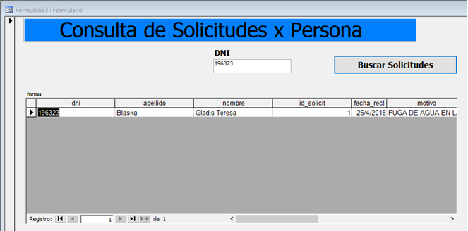

# Access - Claims system

---

I created a new database in Microsoft Access 2003 with the name "SistemaReclamamos2018.mdb".

##Tables:
Streets, segments, persons, reasons, requests, applicants and categories.

##Queries:

I used SQL data definition commands to create the queries needed to create the primary keys for the tables.

PRIMARY KEYS:
Table personas: alter table personas add constraint cpp primary key (dni)
Table calles: alter table calles add constraint cp primary key (id_calle)
Table categorías: alter table categorias add constraint cp primary key (id_categor)
Table motivos: alter table motivos add constraint cp primary key (id_motivo)
Table solicitudes: alter table solicitudes add constraint cp primary key (id_solicit)
Table solicitantes: alter table solicitantes add constraint cp primary key (id_solicit,dni)
Table segmentos: alter table segmentos add constraint cpse primary key (id_segm)

FOREIGN KEYS:
Table solicitantes->personas: alter table solicitantes add constraint cepersol foreign key (dni) references personas
Table motivos->categorias: alter table motivos add constraint cemotcat foreign key (id_categor) references categorias
Table solicitantes->solicitudes: alter table solicitantes add constraint cesolicitantessolil foreign key (id_solicit) references solicitudes
Table solicitudes->calles: alter table solicitudes add constraint cesolcall foreign key (id_calle) references calles
Table solicitudes->motivos: alter table solicitudes add constraint cesolmot foreign key (id_motivo) references motivos

The Relationship diagram or canonical map is as follows:

I created the cross-reference form 1, for which I had to make the following queries.

CROSSDATA QUERY:
SELECT C.CATEGORIA, S.ESTADO, S.ID_SOLICIT
FROM CATEGORIAS AS C, SOLICITUDES AS S, MOTIVOS AS M
WHERE S.ID_MOTIVO=M.ID_MOTIVO AND M.ID_CATEGOR=C.ID_CATEGOR;

CROSSED QUERY:
TRANSFORM Count(datoscruzada.id_solicit) AS cant
SELECT categoria
FROM datoscruzada
GROUP BY categoria
PIVOT estado;
Finally I linked the "CROSSED" query to the data source of the form.

##Crossed references:

I created Form 2 which I linked to the categories table. Inside it I inserted 1 combobox which was created with a subform wizard, so that it can display the type field of the categories table. Then I added a subform to which I linked the query "Query Subform2", which will allow me to display the motifs table.

SUBFORM2 QUERY:
SELECT m.motivo, m.id_motivo, c.id_categor
FROM motivos AS m, categorias AS c
WHERE m.id_categor=c.id_categor;
After this, in the properties of the subform I had to link the main fields (of the main form) with the secondary fields (the subform), the matching fields are id_type. In this way, when selecting a type of claim, the subform will be updated showing the different categories belonging to that type.

The motives table will also have secondary sheets which will allow us to see different specific data. In order to do so, 2 secondary sheets must be inserted. Linking their respective fields so that the nesting can work correctly.

To insert the secondary sheets I had to first create the queries and then go to any record in the table and click on insert secondary sheet. Select the query and then link the primary and secondary field.

The queries were as follows:

Subformulario2 QUERY:
SELECT m.id_motivo, m.motivo, c.id_categor
FROM motivos AS m, categorias AS c
WHERE m.id_categor=c.id_categor;

HojaSecu1 QUERY:
SELECT sol.id_solicit, sol.fecha_alta, c.calle, sol.altura, sol.estado, sol.id_motivo
FROM solicitudes AS sol, motivos AS m, calles AS c
WHERE sol.id_motivo=m.id_motivo and sol.id_calle=c.id_calle;

HojaSecu2 QUERY:
SELECT p.dni, sol.fecha_recl, p.nombre, p.apellido, sol.reiteracio, soli.id_solicit
FROM solicitantes AS sol, solicitudes AS soli, personas AS p
WHERE sol.id_solicit=soli.id_solicit and sol.dni=p.dni;

##Form 2:

Create a new form called form3 where the user will enter a document number and when clicking on a button it will show the fields dni, last name, first name, id_request, date_request, reason, street, height and repetition. The results will be shown in a subform.

To do this I created the form, introduced a text box, a button and a subform. In the textbox we introduce the document number of the person to search for. To create the subform I first created a form called "formu", to which I linked the following query.

Subform Formulario 3 QUERY:
SELECT p.dni, p.apellido, p.nombre, solicitantes.id_solicit, solicitantes.fecha_recl, m.motivo, call.calle, solicitudes.altura, solicitantes.reiteracio
FROM personas AS p, solicitantes AS solicitantes, motivos AS m, calles AS call, solicitudes AS solicitudes
WHERE m.id_motivo=solicitudes.id_motivo And solicitudes.id_calle=call.id_calle And solicitudes.id_solicit=solicitantes.id_solicit And solicitantes.dni=p.dni And p.dni=Texto1;

Then within the subform of form 3 in the data source I linked the form, which in turn is linked to the previous query. In order to perform the search, the operator must enter a document number and then press a button to update the data in the subform. To do this, the following code must be entered into the "on click" event of the search requests button:

Dim sistemareclamos2018 As Database
Dim qdf As QueryDef
Dim rst As Recordset
Set sistemareclamos = CurrentDb
Set qdf = sistemareclamos.QueryDefs("QUERY Subform Formulario 3")
qdf.Parameters("Texto1") = Form_Formulario3.Texto1.Value
Set rst = qdf.OpenRecordset()
Form_formu.dni.ControlSource = "dni"
Form_formu.apellido.ControlSource = "apellido"
Form_formu.nombre.ControlSource = "nombre"
Form_formu.id_solicit.ControlSource = "id_solicit"
Form_formu.fecha_recl.ControlSource = "fecha_recl"
Form_formu.motivo.ControlSource = "motivo"
Form_formu.calle.ControlSource = "calle"
Form_formu.altura.ControlSource = "altura"
Form_formu.reiteracio.ControlSource = "reiteracio"
Set Form_formu.Recordset = rst

##Form 1:

To create the form, I created a new form with the wizard, indicating the tables I was going to work with. Finally, once created, I entered the following query in the record source:

REPORT QUERY:
SELECT c.CATEGORIA, m.MOTIVO, soli.ID_SOLICIT
FROM categorias AS c, motivos AS m, solicitudes AS soli
WHERE c.ID_CATEGOR=m.id_categor AND m.ID_MOTIVO=soli.id_motivo AND soli.ESTADO="P";
After this add the necessary combo boxes with the following query in your control source: =Account([id_Solicit])

##Report:

